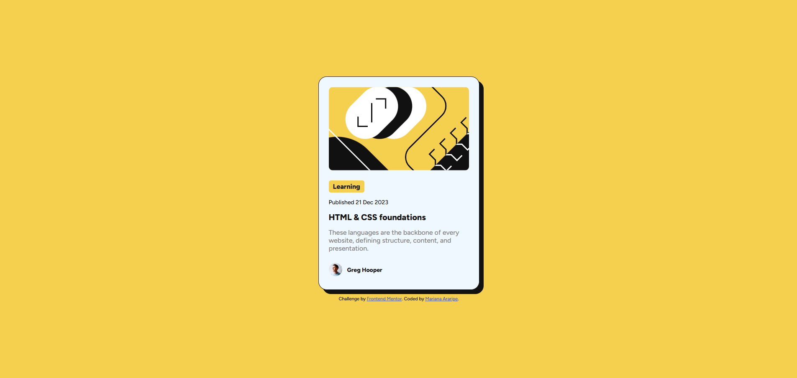

# Frontend Mentor - Blog Preview Card Solution

Este é um projeto baseado no desafio [Blog preview card](https://www.frontendmentor.io/challenges/blog-preview-card-ckPaj01IcS) do Frontend Mentor. O desafio consiste em construir um componente de visualização de blog que respeite o design proposto com atenção a estados de hover e foco.

---

## 🚀 Tecnologias Utilizadas

- HTML5 semântico  
- CSS3 com variáveis personalizadas  
- Flexbox  
- Google Fonts (Figtree)  
- Responsividade básica

---

## 🎯 Objetivo

Praticar a criação de um componente visual com foco em:

- Uso de propriedades CSS (variáveis, transições, etc.)
- Construção de layout com Flexbox
- Aplicação de hover/focus states para elementos interativos
- Fiel reprodução visual de um design estático

---

## 📸 Screenshot

---

## 🔗 Links

- [🔗 Visualizar Projeto](https://marianaararipe.github.io/blog-preview-card/)
- [📁 Repositório no Frontend Mentor](https://www.frontendmentor.io/solutions/blog-preview-card-with-html-and-css-mM11Ydab9S)
- [📂 Código no GitHub](https://github.com/marianaararipe/blog-preview-card)

---

## 💡 O que aprendi/aprimorei

- Como aplicar `box-shadow` para dar profundidade a elementos
- Estilização com `:hover` e `transition` para efeitos suaves
- Organização de classes CSS reutilizáveis

---

## 📚 Recursos úteis

- [Guia do Flexbox - CSS Tricks](https://css-tricks.com/snippets/css/a-guide-to-flexbox/)  
  Um guia visual completo e prático sobre como o Flexbox funciona.

- [Documentação de `transition` - MDN](https://developer.mozilla.org/pt-BR/docs/Web/CSS/transition)  
  Explicação clara sobre como aplicar transições suaves com CSS.

- [Guia de acessibilidade do W3C](https://www.w3.org/WAI/tips/developing/)  
  Dicas para tornar sua página acessível para todos os usuários.

---

## 👤 Autor

- **GitHub:** [@marianaararipe](https://github.com/marianaararipe)  
- **Frontend Mentor:** [@marianaararipe](https://www.frontendmentor.io/profile/marianaararipe)
